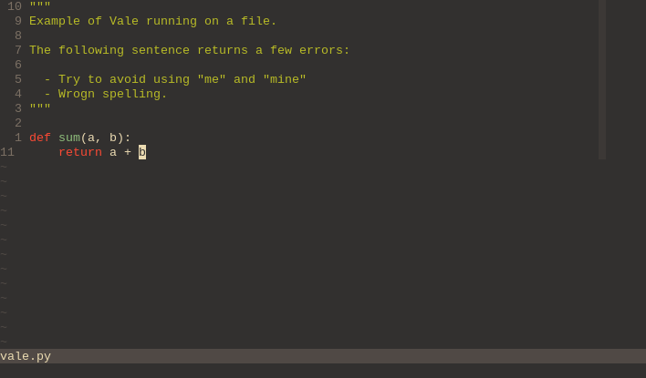

# Vale

A Neovim wrapper around Vale, the syntax-aware linter for prose.

**NOTE**: This is a beta version, please add an issue if you see any errors!



## Installation

Using [vim-plug](https://github.com/junegunn/vim-plug)

```viml
Plug 'marcelofern/vale.nvim'
```

Using [dein](https://github.com/Shougo/dein.vim)

```viml
call dein#add('marcelofern/vale.nvim')
```

Using [packer.nvim](https://github.com/wbthomason/packer.nvim)

```lua
use {
  'marcelofern/vale.nvim'
}
```

## Configuration

```lua
require("vale").setup({
  -- path to the vale binary.
  bin="/bin/vale",
  -- path to your vale-specific configuration.
  vale_config_path="$HOME/.config/vale/vale.ini",
})
```

## Requirements

[Neovim (v0.7.0)](https://github.com/neovim/neovim/releases/tag/v0.7.0) or the
latest neovim nightly commit is required for `vale.nvim` to work.
